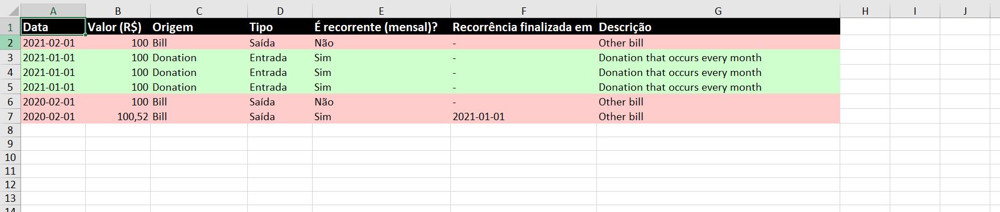

# Reports

Microservice to do exports (in `.xlsx`) and get data from financial-control (the transactions grouped by origin). The admin can choose to allow or not the exports or the data. **The default configuration is both allowed**.

Before running this, pleashe check the `.sample-env` file and then create the `.env` file. The "SECRET" var needs to be the same as the one from the Authentication service.

To run it, use the `docker-compose.yml` file in the main folder from the project.

## Routes

You can check the full description of each one below the table.

| Endpoint                | Only Admin | Request fields           | Headers        | Filters                                 | Description                                                                      |
| ----------------------- | ---------- | ------------------------ | -------------- | --------------------------------------- | -------------------------------------------------------------------------------- |
| GET /api/configs        | False      | -                        | x-access-token | -                                       | Returns the current config                                                       |
| POST /api/configs/      | True       | allowExport, allowCharts | x-access-token | Updates the permissions for the reports |
| GET /api/reports/charts | False      | -                        |                | -                                       | Returns all the transactions from the financial-control server grouped by origin |
| GET /api/reports/export | False      | -                        |                | -                                       | Returns all the transactions in a `.xlsx` file                                   |

### GET /api/configs/

Get the current config for the reports.

When body is passed correctly, returns success (200). Example response:

```json
{
  "current": true,
  "_id": "60a97f2fa1ca5cd59769c861",
  "__v": 0,
  "allowCharts": true,
  "allowExport": false,
  "createdAt": "2021-05-22T22:01:19.704Z",
  "updatedAt": "2021-05-22T22:01:19.704Z"
}
```

If there isn't any config set, returns an empty object.

When token is missing, returns unauthorized (401). When token is incorrect or there was an error, returns internal server error (500).

---

### POST /api/configs/

Creates/updates a current config for permissions

Params:

- allowExport: boolean, optional. This allows everyone to download the sheet with all the transactions
- allowCharts: boolean, optional. This allows everyone to have access to all transactions grouped by origin.

The authentication token needs to be passed in the header field `x-access-token`.

Example request:

```json
{
  "allowExport": false,
  "allowCharts": true
}
```

When body is passed correctly, returns success (200). Example response:

```json
{
  "current": true,
  "_id": "60a97f2fa1ca5cd59769c861",
  "__v": 0,
  "allowCharts": true,
  "allowExport": false,
  "createdAt": "2021-05-22T22:01:19.704Z",
  "updatedAt": "2021-05-22T22:01:19.704Z"
}
```

When token is missing, returns unauthorized (401). When token is incorrect or there was an error with the params passed, returns internal server error (500).

---

### GET /api/reports/charts

Returns all the transactions (including the canceled ones) grouped by origin. It comes from the financial-control server, by the route `/api/grouped-transactions/by-origin/?showCanceled=true`.

When the charts are allowed by the admin, returns success (200). Example response:

```json
[
  {
    "origin": "Donation",
    "totalValue": 300
  },
  {
    "origin": "Bill",
    "totalValue": 300.52
  }
]
```

When the charts aren't allowed, returns forbidden (403). Example response:

```json
{
  "message": "Not allowed",
  "err": null
}
```

When there was an error, returns internal server error (500). When the server is not enabled, returns 503 "Service unavailable".

---

### GET /api/reports/export

Returns all the transactions (including the canceled ones) in a sheet (`.xlsx` file). It comes from the financial-control server, by the route `/api/transactions/?showCanceled=true`.

When the export is allowed by the admin, returns success (200). Example sheet:


When the export isn't allowed, returns forbidden (403). Example response:

```json
{
  "message": "Not allowed",
  "err": null
}
```

When there was an error, returns internal server error (500). When the server is not enabled, returns 503 "Service unavailable".

---

## Testing

The tests that need token, it is necessary to have the authentication service running and have the following user/password registered:

```json
{
  "email": "test@example.com",
  "password": "password1234"
}
```

Then, you can just run:

```
$ npm test
```
