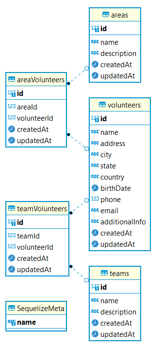

# Volunteers

Microservice to manage volunteers from the organization, separating them in teams and areas. Only the admins can use it.

Before running this, pleashe check the `.sample-env` file and then create the `.env` file. The "SECRET" var needs to be the same as the one from the Authentication service.

To run it, use the `docker-compose.yml` file in the main folder from the project.



## Routes

Basically, there are 5 endpoints (get, get:id, post, put, delete) for each one of the entities (volunteers, areas and teams).You can check the full description of each one below the table.

| Endpoint                   | Only Admin | Request Fields                                                                                 | Headers        | Filters                     | Description                       |
| -------------------------- | ---------- | ---------------------------------------------------------------------------------------------- | -------------- | --------------------------- | --------------------------------- |
| GET /api/volunteers        | True       | -                                                                                              | x-access-token | city, state, areaId, teamId | Returns all volunteers            |
| GET /api/volunteers/:id    | True       | -                                                                                              | x-access-token | -                           | Returns the volunteer with the id |
| POST /api/volunteers/      | True       | name, address, city, state, country, birthDate, phone, email, additionalInfo, areaIds, teamIds | x-access-token | -                           | Creates a new volunteer           |
| PUT /api/volunteers/       | True       | name, address, city, state, country, birthDate, phone, email, additionalInfo, areaIds, teamIds | x-access-token | -                           | Updates the volunteer             |
| DELETE /api/volunteers/:id | True       | -                                                                                              | x-access-token | -                           | Deletes the volunteer             |
| GET /api/areas             | True       | -                                                                                              | x-access-token | volunteerId                 | Returns all the areas             |
| GET /api/areas/:id         | True       | -                                                                                              | x-access-token | -                           | Returns the area with id          |
| POST /api/areas/           | True       | name, description, volunteerIds                                                                | x-access-token | -                           | Creates a new area                |
| PUT /api/areas/            | True       | name, description, volunteerIds                                                                | x-access-token | -                           | Updates the area                  |
| DELETE /api/areas/:id      | True       | -                                                                                              | x-access-token | -                           | Deletes the area                  |
| GET /api/teams             | True       | -                                                                                              | x-access-token | volunteerId                 | Returns all the teams             |
| GET /api/teams/:id         | True       | -                                                                                              | x-access-token | -                           | Returns the team with id          |
| POST /api/teams/           | True       | name, description, volunteerIds                                                                | x-access-token | -                           | Creates a new team                |
| PUT /api/teams/            | True       | name, description, volunteerIds                                                                | x-access-token | -                           | Updates the team                  |
| DELETE /api/teams/:id      | True       | -                                                                                              | x-access-token | -                           | Deletes the team                  |

### GET /api/volunteers/

Lists all volunteers sorted by name.

The authentication token needs to be passed in the header field `x-access-token`.

You can filter by `city`, `state`, `areaId` or `teamId` using query string params (e.g. `/api/volunteers/?state=SP&areaId=1`)

When request is done correctly, returns success (200). Example response:

```json
[
  {
    "id": 121,
    "name": "A Test",
    "address": "Rua outra rua",
    "city": "Sao paulo",
    "state": "SP",
    "country": "Brazil",
    "birthDate": "1990-01-01",
    "phone": "5511999999999",
    "email": "agoravai34@example.com",
    "additionalInfo": "Top demais",
    "createdAt": "2021-04-30T14:01:29.540Z",
    "updatedAt": "2021-04-30T14:01:29.540Z",
    "areas": [],
    "teams": [
      {
        "id": 4,
        "name": "time 2",
        "description": "toptoptoptotpotpotp",
        "createdAt": "2021-04-30T13:59:44.678Z",
        "updatedAt": "2021-04-30T13:59:44.678Z",
        "teamVolunteers": {
          "createdAt": "2021-04-30T14:01:29.555Z",
          "updatedAt": "2021-04-30T14:01:29.555Z",
          "volunteerId": 121,
          "teamId": 4
        }
      }
    ]
  }
]
```

When token is missing, returns unauthorized (401). When token is incorrect or there was an error with the params passed, returns internal server error (500).

---

### GET /api/volunteers/:id

Gets volunteer with id passed

The authentication token needs to be passed in the header field `x-access-token`.

When request is done correctly, returns success (200). Example response:

```json
{
  "id": 121,
  "name": "A Test",
  "address": "Rua outra rua",
  "city": "Sao paulo",
  "state": "SP",
  "country": "Brazil",
  "birthDate": "1990-01-01",
  "phone": "5511999999999",
  "email": "agoravai34@example.com",
  "additionalInfo": "Top demais",
  "createdAt": "2021-04-30T14:01:29.540Z",
  "updatedAt": "2021-04-30T14:01:29.540Z",
  "areas": [],
  "teams": [
    {
      "id": 4,
      "name": "time 2",
      "description": "toptoptoptotpotpotp",
      "createdAt": "2021-04-30T13:59:44.678Z",
      "updatedAt": "2021-04-30T13:59:44.678Z",
      "teamVolunteers": {
        "createdAt": "2021-04-30T14:01:29.555Z",
        "updatedAt": "2021-04-30T14:01:29.555Z",
        "volunteerId": 121,
        "teamId": 4
      }
    }
  ]
}
```

When token is missing, returns unauthorized (401). When token is incorrect or there was an error with the params passed, returns internal server error (500).

---

### POST /api/volunteers/

Creates a new volunteer.

The authentication token needs to be passed in the header field `x-access-token`.

Params:

- name: string
- address: string, optional
- city: string
- state: string (with two uppercased caracters)
- country: string
- birthDate: date, format `yyyy-mm-dd`
- phone: number, with area code
- email: string, must be unique
- additionalInfo: string, optional
- areaIds: array, required but can be empty (`[]`)
- teamIds: array, required but can be empty (`[]`)

Example body:

```json
{
  "name": "Test for docs",
  "address": "Address here, 121",
  "city": "Sao paulo",
  "state": "SP",
  "country": "Brazil",
  "birthDate": "1990-01-01",
  "phone": 5511999999999,
  "email": "docs@example.com",
  "additionalInfo": "Top demais",
  "areaIds": [1],
  "teamIds": []
}
```

When request is done correctly, returns success (200). Example response:

```json
{
  "id": 125,
  "name": "Test for docs",
  "address": "Address here, 121",
  "city": "Sao paulo",
  "state": "SP",
  "country": "Brazil",
  "birthDate": "1990-01-01",
  "phone": "5511999999999",
  "email": "docs@example.com",
  "additionalInfo": "Top demais",
  "updatedAt": "2021-04-30T18:32:05.812Z",
  "createdAt": "2021-04-30T18:32:05.812Z",
  "areaIds": [1],
  "teamIds": []
}
```

When token is missing, returns unauthorized (401). When there is an error with the request body, returns bad request (400). When token is incorrect or there was an error with the params passed, returns internal server error (500).

---

### PUT /api/volunteers/:id

Updates the volunteer from the id passed.

The authentication token needs to be passed in the header field `x-access-token`.

It is necessary to pass all the params (that are mandatory). Params:

- name: string
- address: string, optional
- city: string
- state: string (with two uppercased caracters)
- country: string
- birthDate: date, format `yyyy-mm-dd`
- phone: number, with area code
- email: string, must be unique
- additionalInfo: string, optional
- areaIds: array, required but can be empty (`[]`)
- teamIds: array, required but can be empty (`[]`)

Example body:

```json
{
  "name": "Update Test for docs",
  "address": "Address here, 121",
  "city": "Sao paulo",
  "state": "SP",
  "country": "Brazil",
  "birthDate": "1990-01-01",
  "phone": 5511999999999,
  "email": "docs@example.com",
  "additionalInfo": "Top demais",
  "areaIds": [1],
  "teamIds": []
}
```

When request is done correctly, returns success (200). Example response:

```json
{
  "id": 125,
  "name": "Update Test for docs",
  "address": "Address here, 121",
  "city": "Sao paulo",
  "state": "SP",
  "country": "Brazil",
  "birthDate": "1990-01-01",
  "phone": 5511999999999,
  "email": "docs@example.com",
  "additionalInfo": "Top demais",
  "createdAt": "2021-04-30T18:32:05.812Z",
  "updatedAt": "2021-04-30T18:38:40.161Z",
  "areaIds": [1],
  "teamIds": []
}
```

When token is missing, returns unauthorized (401). When there is an error with the request body, returns bad request (400). When token is incorrect or there was an error with the params passed, returns internal server error (500).

---

### DELETE /api/volunteers/:id

Deletes the volunteer from the id passed.

The authentication token needs to be passed in the header field `x-access-token`.

When request is done correctly, returns success (200). Example response:

```json
{
  "message": "Destroyed!"
}
```

When token is missing, returns unauthorized (401). When token is incorrect or there was an error with the params passed, returns internal server error (500).

---

### GET /api/areas/

Lists all areas sorted by name.

The authentication token needs to be passed in the header field `x-access-token`.

You can filter by `volunteerId` using query string params (e.g. `/api/volunteers/?volunteerId=1`)

When request is done correctly, returns success (200). Example response:

```json
[
  {
    "id": 2,
    "name": "bleus",
    "description": " qualquer coisa",
    "createdAt": "2021-04-27T21:53:29.429Z",
    "updatedAt": "2021-04-27T23:30:26.612Z",
    "volunteers": [
      {
        "id": 1,
        "name": "Test",
        "address": "Rua outra rua",
        "city": "Sao paulo",
        "state": "SP",
        "country": "Brazil",
        "birthDate": "1990-01-01",
        "phone": "5511999999999",
        "email": "example5@example.com",
        "additionalInfo": "Top demais",
        "createdAt": "2021-04-27T21:41:02.046Z",
        "updatedAt": "2021-04-27T21:41:02.046Z",
        "areaVolunteers": {
          "createdAt": "2021-04-27T21:53:29.445Z",
          "updatedAt": "2021-04-27T21:53:29.445Z",
          "volunteerId": 1,
          "areaId": 2
        }
      }
    ]
  }
]
```

When token is missing, returns unauthorized (401). When token is incorrect or there was an error with the params passed, returns internal server error (500).

---

### GET /api/areas/:id

Gets area with id passed

The authentication token needs to be passed in the header field `x-access-token`.

When request is done correctly, returns success (200). Example response:

```json
{
  "id": 2,
  "name": "bleus",
  "description": "qualquer coisa",
  "createdAt": "2021-04-27T21:53:29.429Z",
  "updatedAt": "2021-04-27T23:30:26.612Z",
  "volunteers": [
    {
      "id": 1,
      "name": "Test",
      "address": "Rua outra rua",
      "city": "Sao paulo",
      "state": "SP",
      "country": "Brazil",
      "birthDate": "1990-01-01",
      "phone": "5511999999999",
      "email": "example5@example.com",
      "additionalInfo": "Top demais",
      "createdAt": "2021-04-27T21:41:02.046Z",
      "updatedAt": "2021-04-27T21:41:02.046Z",
      "areaVolunteers": {
        "createdAt": "2021-04-27T21:53:29.445Z",
        "updatedAt": "2021-04-27T21:53:29.445Z",
        "volunteerId": 1,
        "areaId": 2
      }
    }
  ]
}
```

When token is missing, returns unauthorized (401). When token is incorrect or there was an error with the params passed, returns internal server error (500).

---

### POST /api/areas/

Creates a new area.

The authentication token needs to be passed in the header field `x-access-token`.

Params:

- name: string, must be unique
- description: string, optional
- volunteerIds: array, required but can be empty (`[]`)

Example body:

```json
{
  "name": "Area for docs",
  "description": "this is a great area",
  "volunteerIds": [8, 9, 10]
}
```

When request is done correctly, returns success (200). Example response:

```json
{
  "id": 5,
  "name": "Area for docs",
  "description": "this is a great area",
  "updatedAt": "2021-04-30T18:56:07.300Z",
  "createdAt": "2021-04-30T18:56:07.300Z",
  "volunteerIds": [8, 9, 10]
}
```

When token is missing, returns unauthorized (401). When there is an error with the request body, returns bad request (400). When token is incorrect or there was an error with the params passed, returns internal server error (500).

---

### PUT /api/areas/:id

Updates the area from the id passed.

The authentication token needs to be passed in the header field `x-access-token`.

It is necessary to pass all the params (that are mandatory). Params:

- name: string, must be unique
- description: string, optional
- volunteerIds: array, required but can be empty (`[]`)

Example body:

```json
{
  "name": "Area for docs",
  "description": "Updated: this is not a great area",
  "volunteerIds": [8, 9]
}
```

When request is done correctly, returns success (200). Example response:

```json
{
  "id": 5,
  "name": "Area for docs",
  "description": "Updated: this is not a great area",
  "createdAt": "2021-04-30T18:56:07.300Z",
  "updatedAt": "2021-04-30T18:58:18.624Z",
  "volunteerIds": [8, 9]
}
```

When token is missing, returns unauthorized (401). When there is an error with the request body, returns bad request (400). When token is incorrect or there was an error with the params passed, returns internal server error (500).

---

### DELETE /api/areas/:id

Deletes the area from the id passed.

The authentication token needs to be passed in the header field `x-access-token`.

When request is done correctly, returns success (200). Example response:

```json
{
  "message": "Destroyed!"
}
```

When token is missing, returns unauthorized (401). When token is incorrect or there was an error with the params passed, returns internal server error (500).

---

### GET /api/teams/

Lists all teams sorted by name.

The authentication token needs to be passed in the header field `x-access-token`.

You can filter by `volunteerId` using query string params (e.g. `/api/volunteers/?volunteerId=1`)

When request is done correctly, returns success (200). Example response:

```json
[
  {
    "id": 2,
    "name": "bleus",
    "description": " qualquer coisa",
    "createdAt": "2021-04-27T21:53:29.429Z",
    "updatedAt": "2021-04-27T23:30:26.612Z",
    "volunteers": [
      {
        "id": 1,
        "name": "Test",
        "address": "Rua outra rua",
        "city": "Sao paulo",
        "state": "SP",
        "country": "Brazil",
        "birthDate": "1990-01-01",
        "phone": "5511999999999",
        "email": "example5@example.com",
        "additionalInfo": "Top demais",
        "createdAt": "2021-04-27T21:41:02.046Z",
        "updatedAt": "2021-04-27T21:41:02.046Z",
        "teamVolunteers": {
          "createdAt": "2021-04-27T21:53:29.445Z",
          "updatedAt": "2021-04-27T21:53:29.445Z",
          "volunteerId": 1,
          "teamId": 2
        }
      }
    ]
  }
]
```

When token is missing, returns unauthorized (401). When token is incorrect or there was an error with the params passed, returns internal server error (500).

---

### GET /api/teams/:id

Gets team with id passed

The authentication token needs to be passed in the header field `x-access-token`.

When request is done correctly, returns success (200). Example response:

```json
{
  "id": 2,
  "name": "bleus",
  "description": "qualquer coisa",
  "createdAt": "2021-04-27T21:53:29.429Z",
  "updatedAt": "2021-04-27T23:30:26.612Z",
  "volunteers": [
    {
      "id": 1,
      "name": "Test",
      "address": "Rua outra rua",
      "city": "Sao paulo",
      "state": "SP",
      "country": "Brazil",
      "birthDate": "1990-01-01",
      "phone": "5511999999999",
      "email": "example5@example.com",
      "additionalInfo": "Top demais",
      "createdAt": "2021-04-27T21:41:02.046Z",
      "updatedAt": "2021-04-27T21:41:02.046Z",
      "teamVolunteers": {
        "createdAt": "2021-04-27T21:53:29.445Z",
        "updatedAt": "2021-04-27T21:53:29.445Z",
        "volunteerId": 1,
        "teamId": 2
      }
    }
  ]
}
```

When token is missing, returns unauthorized (401). When token is incorrect or there was an error with the params passed, returns internal server error (500).

---

### POST /api/teams/

Creates a new team.

The authentication token needs to be passed in the header field `x-access-token`.

Params:

- name: string, must be unique
- description: string, optional
- volunteerIds: array, required but can be empty (`[]`)

Example body:

```json
{
  "name": "Area for docs",
  "description": "this is a great team",
  "volunteerIds": [8, 9, 10]
}
```

When request is done correctly, returns success (200). Example response:

```json
{
  "id": 5,
  "name": "Area for docs",
  "description": "this is a great team",
  "updatedAt": "2021-04-30T18:56:07.300Z",
  "createdAt": "2021-04-30T18:56:07.300Z",
  "volunteerIds": [8, 9, 10]
}
```

When token is missing, returns unauthorized (401). When there is an error with the request body, returns bad request (400). When token is incorrect or there was an error with the params passed, returns internal server error (500).

---

### PUT /api/teams/:id

Updates the team from the id passed.

The authentication token needs to be passed in the header field `x-access-token`.

It is necessary to pass all the params (that are mandatory). Params:

- name: string, must be unique
- description: string, optional
- volunteerIds: array, required but can be empty (`[]`)

Example body:

```json
{
  "name": "Area for docs",
  "description": "Updated: this is not a great team",
  "volunteerIds": [8, 9]
}
```

When request is done correctly, returns success (200). Example response:

```json
{
  "id": 5,
  "name": "Area for docs",
  "description": "Updated: this is not a great team",
  "createdAt": "2021-04-30T18:56:07.300Z",
  "updatedAt": "2021-04-30T18:58:18.624Z",
  "volunteerIds": [8, 9]
}
```

When token is missing, returns unauthorized (401). When there is an error with the request body, returns bad request (400). When token is incorrect or there was an error with the params passed, returns internal server error (500).

---

### DELETE /api/teams/:id

Deletes the area from the id passed.

The authentication token needs to be passed in the header field `x-access-token`.

When request is done correctly, returns success (200). Example response:

```json
{
  "message": "Destroyed!"
}
```

When token is missing, returns unauthorized (401). When token is incorrect or there was an error with the params passed, returns internal server error (500).

---

## Testing

The tests that need token, it is necessary to have the authentication service running and have the following user/password registered:

```
{
  email: "test@example.com",
  password: "password1234"
}
```

Then, you can just run:

```
$ npm test
```
